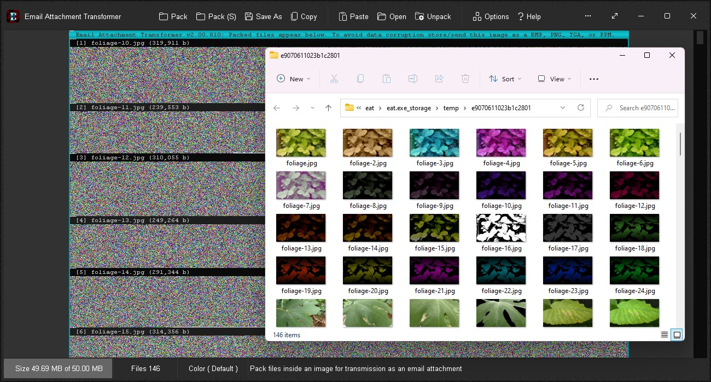
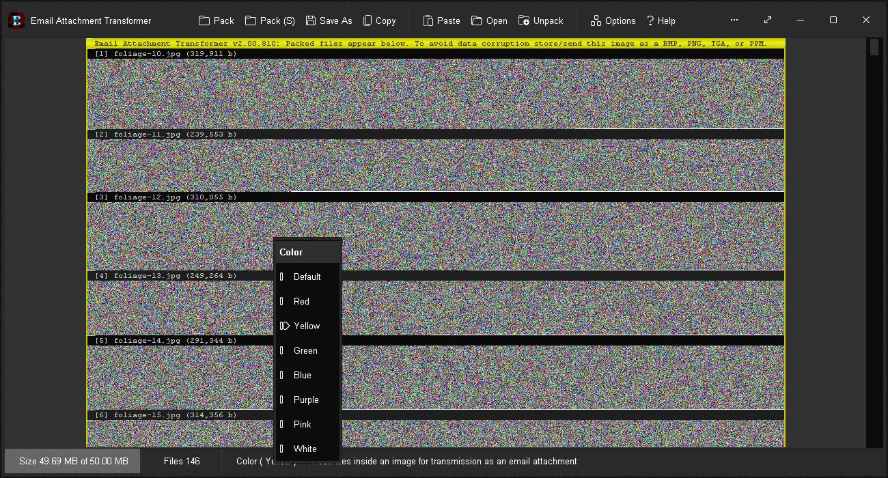

# Email Attachment Transformer
Can't email your important files through?  Tired of being messed about?  Then pack them inside an image with Email Attachment Transformer and send them off.

# Features
* Various pack options: Pack folder files (all files in a folder), pack folder files and sub-folders (all files in a folder and it's sub-folders), or pack dropped files
* Store upto 50 MB of files (more with compression)
* Pack fast and without fuss with auto clear.  Previous content is wiped and new content packed cleanly with no need to reset, clear or start afresh between packs.
* Each file has a visual label with it's number, path, name, and file size
* Automatic compression for best fit
* 8 header and footer colors: Default, Red, Yellow, Green, Blue, Purple, Pink and White
* Packed files are stored inside a single, lossless bitmap image
* Copy the image to Clipboard and paste directly into your email message, or save as a BMP, PNG, TGA or PPM and attach to your email message and send
* Email recipient can easily drag and drop the image straight onto Email Attachment Transformer, or paste it in from Clipboard, or load it up from file, and click the "Unpack" link for a temporary folder with all files unpacked ready for access.
* Both sender and recipient require a copy of Email Attachment Transformer
* Options Window - Easily change app color, font and settings
* Portable

# Download
<a href="src/eat.exe">eat.exe</a>

# Images

